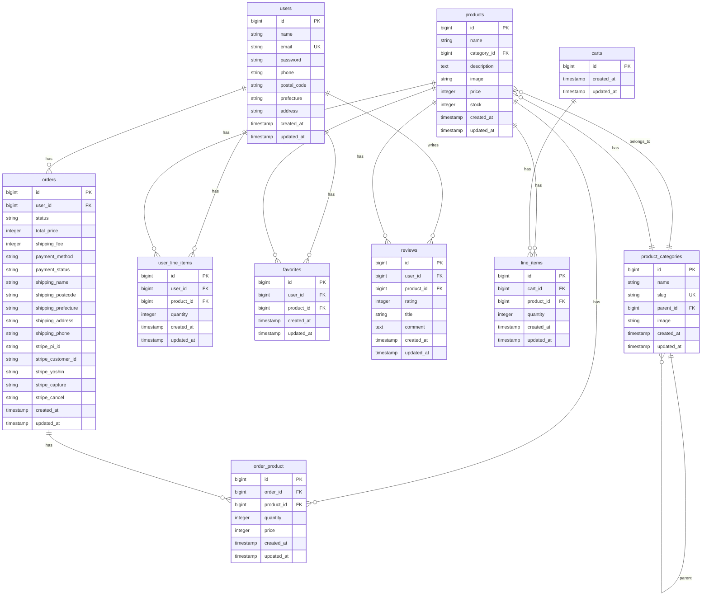

# ファッションECサイト

**ファッションECサイトのポートフォリオです**


## 目次

- [サイトURL](#サイトurl)
- [サイトの概要](#サイトの概要)
- [サービスを開発した背景](#サービスを開発した背景)
- [画面や機能の説明](#画面や機能の説明)
- [主な使用技術](#主な使用技術)
- [ER図](#er図)
- [インフラ構成図](#インフラ構成図)
- [工夫した点・苦労した点](#工夫した点・苦労した点)
- [今後の拡張・改善](#今後の拡張・改善)

## サイトURL

<!-- 実際のデプロイURLを記載してください -->
```
https://ec-site.ars-system.net/
```

## サイトの概要

ファッション系の架空ECサイトです。ユーザー側では商品を閲覧・検索し、カートに追加して購入することができます。また、お気に入り機能やレビュー機能、クレジット決済機能を導入し実務を意識した実装を行っています。管理画面側では、商品や商品カテゴリの登録や編集、注文一覧や売上履歴の確認を行うことができます。

### 主な機能

- **商品検索・閲覧**: カテゴリ別の商品一覧と検索機能
- **ログイン・会員登録機能**: ログインと会員登録が可能
- **お気に入り機能**: 気になる商品を保存して後から購入可能（ゲスト時・ログイン時両方対応）
- **レビュー機能**: 購入した商品にレビューを投稿・編集可能
- **クレジット（stripe）決済**: Stripeによるクレジットカード決済
- **管理機能**: 商品管理、注文管理、売上管理などの充実した管理画面

## サービスを開発した背景

現職では ECサイトの運用・保守業務を担当しており、不具合発生時の調査やバグ修正に加え、既存機能の改修や新機能の追加にも携わっています。
具体的には、Stripe の旧決済処理から新しい処理方式への移行対応や、領収書発行機能の追加など、運用中のECサイトに対する機能改善・拡張を行ってきました。

これらの業務を通じて、部分的な改修だけでなく、「ECサイト全体の構成や、注文・決済・管理機能がどのように連携して動作しているのか」をより深く理解する必要性を感じるようになりました。
そこで、既存コードの修正にとどまらず、要件整理から設計、実装までを一貫して経験することを目的に、ECサイトを一から開発しました。

本サイトでは、実務で得た知見を活かした、より実践的なECサイト開発経験を積むことを目的としています。

## 🖥️ 画面や機能の説明

#### 1. トップページ
- メイン画像によるビジュアル訴求
- カテゴリ別商品一覧
- ランキング表示（売上数ベース）
- 新着商品表示


#### 2. 商品一覧・検索
- カテゴリ別の商品一覧表示
- 商品検索機能
- ランキング・新着商品でのソート


#### 3. 商品詳細
- 商品画像・詳細情報の表示
- 在庫数の表示
- カートへの追加機能
- お気に入り登録機能
- レビュー一覧・投稿機能


#### 4. カート機能
- ゲストユーザー・ログインユーザー両対応
- カート内商品の確認・削除
- チェックアウト機能


#### 5. 注文・決済
- 注文情報の確認（配送先情報）
- Stripeによるクレジットカード決済
- 注文完了画面


#### 6. ログイン・会員登録
- ログイン機能
- 会員登録機能
- 郵便番号検索機能


#### 7. マイページ
- 注文履歴の確認
- 注文詳細の表示
- プロフィール編集
- レビュー投稿・編集


### 管理画面機能

#### 1. 商品管理
- 商品一覧・登録・編集・削除
- 在庫管理
- カテゴリ管理（親カテゴリ・子カテゴリ）


#### 2. 注文管理
- 注文一覧・詳細表示
- 注文ステータス管理
- 領収書発行（PDF）


#### 3. 売上管理
- 日次売上集計
- 月次売上集計
- 期間指定での売上検索


## 主な使用技術

### バックエンド
- **Laravel 11**: PHPフレームワーク
- **PHP 8.2**: プログラミング言語
- **MySQL 8.0**: リレーショナルデータベース

### フロントエンド
- **bootstrap**: CSSフレームワーク
- **Font Awesome**: アイコンライブラリ

### 決済・外部サービス
- **Stripe**: クレジットカード決済API
- **Laravel DomPDF**: PDF生成（領収書発行）

### 開発環境・インフラ
- **Docker / Docker Compose**: コンテナ化
- **Laravel Sail**: 開発環境

### その他
- **Laravel Breeze**: 認証機能

## ER図



## インフラ構成図


### インフラ構成の詳細

- **Laravel Application**: メインアプリケーション（PHP 8.4）
- **MySQL**: データベースサーバー
- **phpMyAdmin**: データベース管理ツール
- **Stripe**: 外部決済API

## 工夫した点・苦労した点

- **カート機能**：ゲスト利用時とログイン後でデータの持ち方を切り替える設計を採用しています。ゲスト時は line_items テーブル、ログイン時は user_line_items テーブルを使用し、いずれの状態でも商品をカートに追加できるようにしました。また、ログイン時には MergeGuestCartOnLogin イベントリスナーを用いて、ゲスト時のカート情報をログインユーザーのカートへ自動的にマージする処理を実装しています。これにより、ログイン前後でカート内容が失われることなく、スムーズな購買体験を提供できるようにしました。

- **お気に入り機能**：ゲストでも利用可能な設計とし、ログイン状態に応じて保存先を切り替えています。ゲスト時は LocalStorage に保存し、ログイン後はデータベースに保存する構成としました。さらに、ログイン時に LocalStorage 上のお気に入り情報をデータベースの情報と統合する処理を実装することで、会員登録前に追加したお気に入りも引き継がれるようにしています。

- **決済機能**：Stripe を採用し、実務を想定した三段階の決済フローを実装しました。与信（予約）、確定（capture）、キャンセルの各処理を明確に分離し、管理画面で注文ステータスを変更した際には、それに応じて決済ステータスも自動的に更新されるよう連携させています。


## 今後の拡張・改善

- **商品の非公開設定**：
現状では商品は常に公開状態となっており、在庫切れや準備中の商品を一時的に非表示にすることができません。
そのため、管理画面から商品を非公開に設定できる機能を追加し、販売状況に応じた柔軟な商品管理を可能にします。

- **タグ付け機能**：
商品検索性の向上を目的として、商品に複数のタグを付与できる機能の追加を検討しています。
カテゴリとは別にタグを設けることで、「季節」「用途」「キャンペーン」など、柔軟な切り口での商品分類を可能にします。
実装では、商品とタグの多対多関係を想定し、中間テーブルを用いたデータ設計を行う予定です。


---

